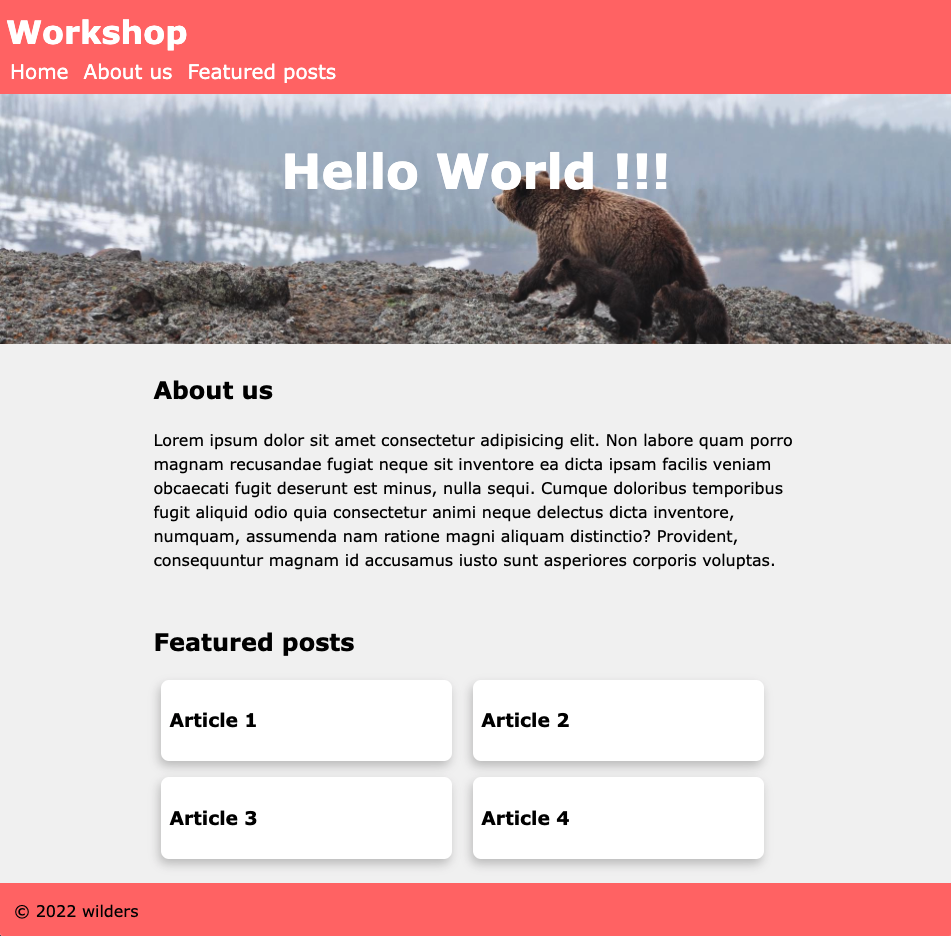

# HTML/CSS Basics workshop 

> ⚠️ Rules for this workshop: build and design a web page only with a semantic HTML structure (no class, no id in CSS). 

## Initialisation

- In a new folder, create an *index.html* file.
- Open the file with your favorite IDE and add the HTML5 basic tags (DOCTYPE, html, head, body).
- Create a *style.css* file.
- In the `<head>`, first add some mandatory tags as `<meta>` or `<title>`:
  ```html
  <head>
    <meta charset="UTF-8">
    <meta name="viewport" content="width=device-width, initial-scale=1.0">
    <title>CSS Workshop</title>
  </head>
  ```
- Then add a `<link>` tag with the link to *style.css*.
- In *index.html*, in the `<body>`, add a `<h1>` tag with the text `Hello world !!!`.
- In *style.css*, add the code:
  ```css
  h1 {
    color: #f76c6c; 
  }
  ```
- Open *index.html* in your browser, and check that you can read the message: 'Hello world !!!' in WCS pink.

Good job !

## Layout of your website

You will have to create a basic home page following the layout below (**do not try** to be pixel perfect, this image is just a guide). 



> Hint: Browsers have default size for each HTML elements (margin, font-size, etc.). It is useful but sometimes you will prefer to reset some default behaviour. In this workshop, it could be interesting to remove margin on `<body>`. Furthermore, use `box-sizing: border-box` on each element will help you to deal element sizing (more info about [box-sizing](https://developer.mozilla.org/en-US/docs/Web/CSS/box-sizing)).
>
> ```css
> * {
>   box-sizing: border-box;
> }
>
> body {
>   margin:0;
> }
> ```

### Navbar

- Try to reproduce the navbar. Start to create a `<nav>` tag and add the background color `#f76c6c`.
- Then, analyse the navbar structure. You have a brand name "Workshop" at the top left and a group of menu items below.
- Using an unordered list can be a good idea for the menu group, but don't forget to display it horizontally and without the bullets.

### Header

- Wrap your `<h1>` in a `<header>` tag and add a 250px min-height. 
- Add a background image (e.g a ramdon one on [loremflicker](https://loremflickr.com/1200/300)).
- Center your main title and change font size / color if necessary.

> Hint: [Manage background size](https://developer.mozilla.org/en-US/docs/Web/CSS/background-size)

### "About us" Section

- Good practice is to wrap sections in a `<main>` tag.
- Add a first `<section>` and a `<h2>` according to the template.
- Add some fake text in a paragraph. Change `line-height` (1.5) and `font-family` (Verdana) to improve readability. This can be done in the `body` properties.
- Limit the `max-width` to 65ch. This will ensure you have a text width that does not exceed 85 characters making reading more comfortable.
> A little explanation: in css, the unit `ch` is a unit relative to the width of character 0 (the widest character in most fonts). Specifying 65ch allows us to ensure a column width of between 65 and about 85 characters for all signs combined, a text block width that is highly recommended by numerous studies on digital accessibility and our reading behaviour. More explanation on [this article](https://medium.com/@matuzo/writing-css-with-accessibility-in-mind-8514a0007939) or [this one](https://www.smashingmagazine.com/2014/09/balancing-line-length-font-size-responsive-web-design/#line-length-measure-and-reading) if you are interested in the subject.


- Finally, you can use the `margin` property to center the block horizontally.

> Hint: [Centering in CSS: A complete guide](https://css-tricks.com/centering-css-complete-guide/)

### Featured posts Section

- Add a new section.
- Give it a `<h2>` with the appropriated text content. 
- Add 4 `<article>` children below.
- Each article might have `<h1>` containing his name. 
- Adjust the layout to get 2 items per line with the `display` and `width` properties.
Rounding and drop shadow effects can be achieved with `border-radius` and `box-shadow`.

### Footer

Because you have a `<header>`, you need a `<footer>`. This should not be a problem for you 😉.
